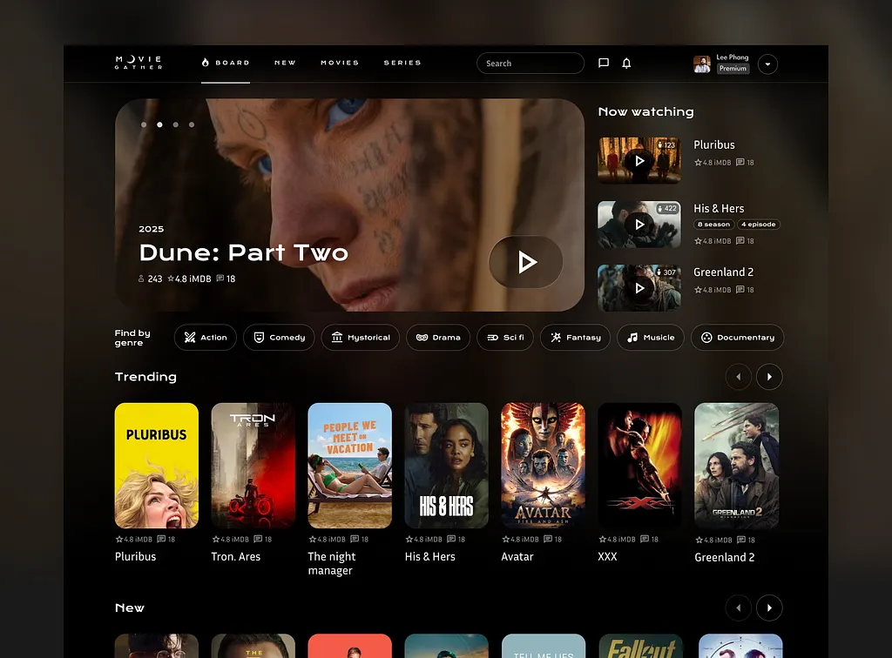

# References — Trending-Movies

## 1. Objetivo

As referências abaixo orientam as decisões de experiência e interface.

## 2. Referência 01 — MovieGather

### Fonte
Imagem de UI compartilhada pelo desenvolvedor durante a especificação do projeto.

### Imagem

### O que observamos?
Interface dark mode com Header escuro, seções horizontais de cards de filmes com poster, título e nota IMDB, e paleta de cores em tons de preto/cinza escuro com detalhes em amarelo/laranja.

### O que vamos aproveitar?
- Tema dark mode geral
- Estrutura de card: poster + título + nota ⭐
- Header escuro com logo à esquerda e navegação à direita
- Grid de cards para listagem de filmes e séries

### Como será adaptado?
Versão simplificada: sem banner hero, sem sidebar "Now watching", sem filtros por gênero e sem setas de navegação. O grid será estático (sem scroll horizontal controlado por botões).